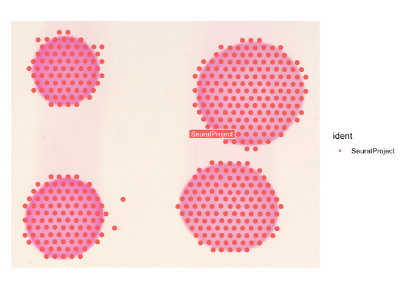
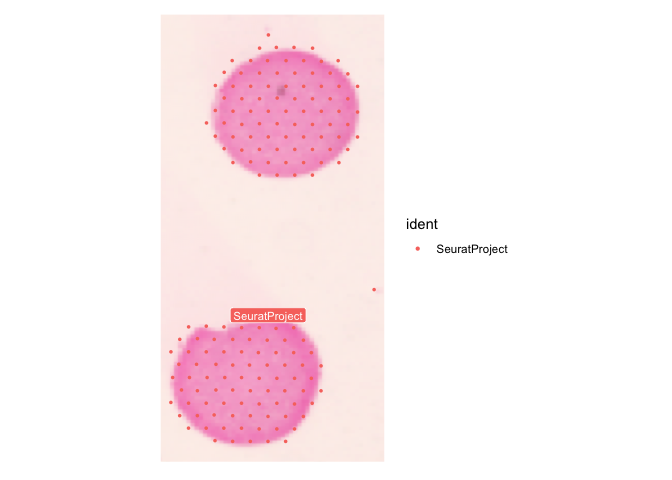

Import and data processing for Visium Batch 1 on gGBOs
================
Yusha Sun
2025-06-23

``` r
library(Seurat)
library(tidyverse)
library(ggplot2)
library(patchwork)
library(cowplot)
options(future.globals.maxSize = 1e9)
setwd("~/Library/CloudStorage/Box-Box/GBO_2/Hypoxia_Structure/GBM_Spatial")
source('~/Library/CloudStorage/Box-Box/GBO/SEQ_tools/useful_functions.R')
```

``` r
GBO <- Load10X_Spatial('~/Library/CloudStorage/Box-Box/GBO_2/Hypoxia_Structure/GBM_Spatial/Visium_FFPE/10072_9059/outs/',
                       filename = 'filtered_feature_bc_matrix.h5')
coords <- GetTissueCoordinates(GBO)
GBO@meta.data$x.coord <- coords[,1]
GBO@meta.data$y.coord  <- coords[,2]
GBO@meta.data$cells <- rownames(GBO@meta.data)

cells <- GBO@meta.data %>%
  dplyr::filter(x.coord < 1350, x.coord > 750,
                y.coord > 500, y.coord < 1300)
combined_10072 <- subset(GBO, cells = cells$cells)
```

    ## Warning: Not validating Centroids objects
    ## Not validating Centroids objects

    ## Warning: Not validating FOV objects
    ## Not validating FOV objects
    ## Not validating FOV objects
    ## Not validating FOV objects
    ## Not validating FOV objects
    ## Not validating FOV objects

    ## Warning: Not validating Seurat objects

``` r
SpatialDimPlot(combined_10072, label = TRUE, label.size = 3, pt.size.factor = 5, image.alpha = 1) + theme(aspect.ratio = 0.8)
```

    ## Scale for fill is already present.
    ## Adding another scale for fill, which will replace the existing scale.

<!-- -->

``` r
cells <- GBO@meta.data %>%
  dplyr::filter(x.coord < 2200, x.coord > 1590,
                y.coord > 1950, y.coord < 2250)
combined_9059 <- subset(GBO, cells = cells$cells)
```

    ## Warning: Not validating Centroids objects

    ## Warning: Not validating Centroids objects

    ## Warning: Not validating FOV objects
    ## Not validating FOV objects
    ## Not validating FOV objects
    ## Not validating FOV objects
    ## Not validating FOV objects
    ## Not validating FOV objects

    ## Warning: Not validating Seurat objects

``` r
SpatialDimPlot(combined_9059, label = TRUE, label.size = 3, pt.size.factor = 5, image.alpha = 1) + theme(aspect.ratio = 2)
```

    ## Scale for fill is already present.
    ## Adding another scale for fill, which will replace the existing scale.

<!-- -->

``` r
installed.packages()[names(sessionInfo()$otherPkgs), "Version"]
```

    ##      viridis  viridisLite      cowplot    patchwork    lubridate      forcats 
    ##      "0.6.5"      "0.4.2"      "1.1.3"      "1.3.0"      "1.9.4"      "1.0.0" 
    ##      stringr        dplyr        purrr        readr        tidyr       tibble 
    ##      "1.5.1"      "1.1.4"      "1.0.4"      "2.1.5"      "1.3.1"      "3.2.1" 
    ##      ggplot2    tidyverse       Seurat SeuratObject           sp 
    ##      "3.5.2"      "2.0.0"      "5.3.0"      "5.1.0"      "2.2-0"
