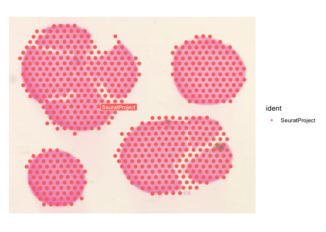
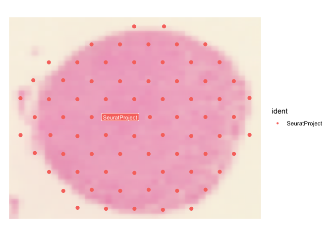
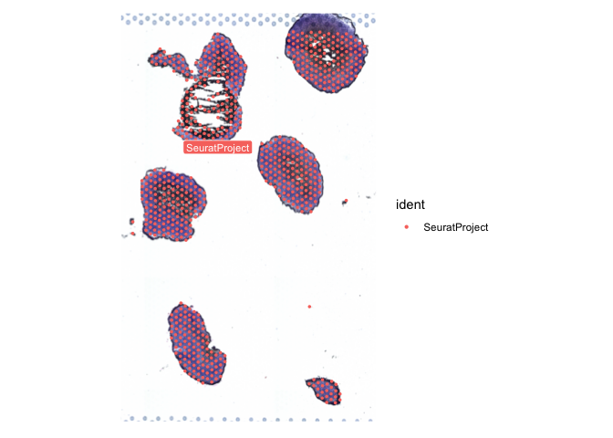
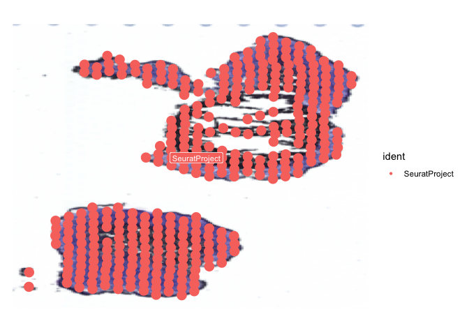
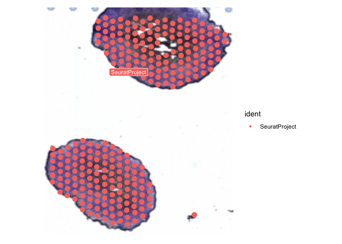
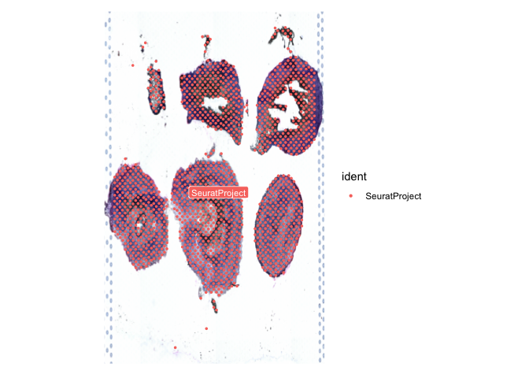
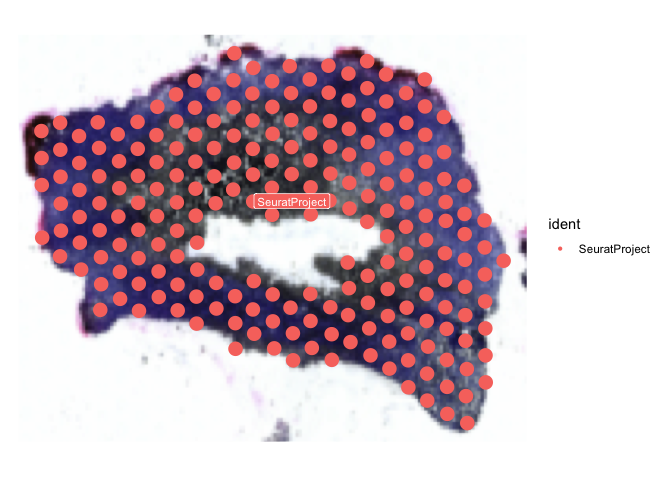
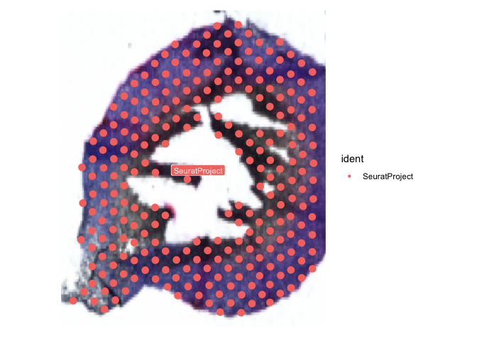
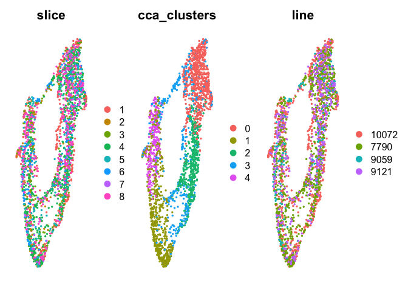
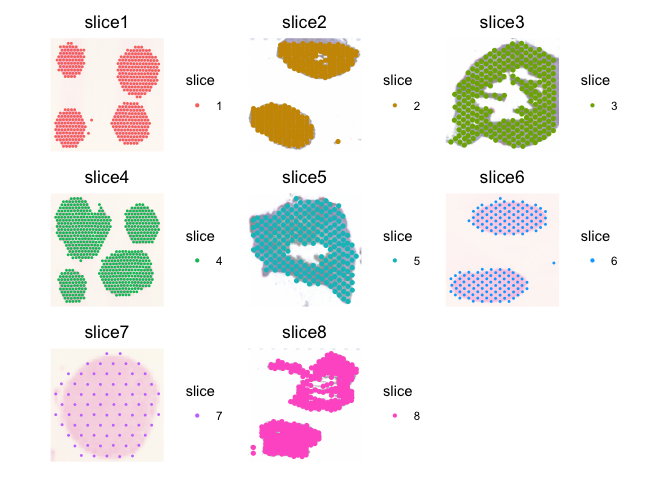

Import and data processing for Visium Batch 1 and 2 on gGBOs
================
Yusha Sun
2025-06-23

``` r
library(Seurat)
library(tidyverse)
library(ggplot2)
library(patchwork)
library(cowplot)
options(future.globals.maxSize = 1e9)
setwd("~/Library/CloudStorage/Box-Box/GBO_2/Hypoxia_Structure/GBM_Spatial")
source('~/Library/CloudStorage/Box-Box/GBO/SEQ_tools/useful_functions.R')
```

In these sections, we will import the gGBO 10X Visium spatial
transcriptomic sections. To re-run this code, set the directories
accordingly based on the processed data on GEO.

First, we import FFPE (Batch 2) for UP-10072 and UP-9059 in order.

``` r
GBO <- Load10X_Spatial('~/Library/CloudStorage/Box-Box/GBO_2/Hypoxia_Structure/GBM_Spatial/Visium_FFPE/10072_9059/outs/',
                       filename = 'filtered_feature_bc_matrix.h5')
coords <- GetTissueCoordinates(GBO)
GBO@meta.data$x.coord <- coords[,1]
GBO@meta.data$y.coord  <- coords[,2]
GBO@meta.data$cells <- rownames(GBO@meta.data)

cells <- GBO@meta.data %>%
  dplyr::filter(x.coord < 1350, x.coord > 750,
                y.coord > 500, y.coord < 1300)
combined_10072 <- subset(GBO, cells = cells$cells)
SpatialDimPlot(combined_10072, label = TRUE, label.size = 3, pt.size.factor = 5, image.alpha = 1) + theme(aspect.ratio = 0.8)
```

<!-- -->

``` r
cells <- GBO@meta.data %>%
  dplyr::filter(x.coord < 2200, x.coord > 1590,
                y.coord > 1950, y.coord < 2250)
combined_9059 <- subset(GBO, cells = cells$cells)
SpatialDimPlot(combined_9059, label = TRUE, label.size = 3, pt.size.factor = 5, image.alpha = 1) + theme(aspect.ratio = 2)
```

<!-- -->

We next import FFPE (Batch 2) for UP-9121 and UP-7790 in order.

``` r
GBO <- Load10X_Spatial('~/Library/CloudStorage/Box-Box/GBO_2/Hypoxia_Structure/GBM_Spatial/Visium_FFPE/9121_7790/outs/',
                       filename = 'filtered_feature_bc_matrix.h5')
#SpatialDimPlot(GBO, label = TRUE, label.size = 3, pt.size.factor = 2.25) + theme(aspect.ratio = 0.6)
#SpatialDimPlot(GBO, crop = TRUE, label = TRUE, interactive = TRUE)
coords <- GetTissueCoordinates(GBO)
GBO@meta.data$x.coord <- coords[,1]
GBO@meta.data$y.coord  <- coords[,2]
GBO@meta.data$cells <- rownames(GBO@meta.data)

cells <- GBO@meta.data %>%
  dplyr::filter(x.coord < 1950, x.coord > 1300,
                y.coord > 780, y.coord < 1500)
combined_7790 <- subset(GBO, cells = cells$cells)
SpatialDimPlot(combined_7790, label = TRUE, label.size = 3, pt.size.factor = 5, image.alpha = 1) + theme(aspect.ratio = 0.8)
```

<!-- -->

``` r
cells <- GBO@meta.data %>%
  dplyr::filter(x.coord < 1680, x.coord > 1350,
                y.coord > 1700, y.coord < 2050)
combined_9121 <- subset(GBO, cells = cells$cells)
SpatialDimPlot(combined_9121, label = TRUE, label.size = 3, pt.size.factor = 5, image.alpha = 1) + theme(aspect.ratio = 0.8)
```

<!-- -->

Next up is FF (Batch 1) for several organoids in slice A. The top
organoid in combined_9121_2 had some sectioning artifact in the middle
and we proceed cautiously with analyses with this organoid, removing it
for calculations of distance from the rim.

``` r
GBO <- Load10X_Spatial('~/Library/CloudStorage/Box-Box/GBO_2/Hypoxia_Structure/GBM_Spatial/FF_Visium_10_2024/Visium_A/outs/',
                       filename = 'filtered_feature_bc_matrix.h5')
SpatialDimPlot(GBO, label = TRUE, label.size = 3, pt.size.factor = 2.25) + theme(aspect.ratio = 1.6)
```

<!-- -->

``` r
#SpatialDimPlot(GBO, crop = TRUE, label = TRUE, interactive = TRUE)
coords <- GetTissueCoordinates(GBO)
GBO@meta.data$x.coord <- coords[,1]
GBO@meta.data$y.coord  <- coords[,2]
GBO@meta.data$cells <- rownames(GBO@meta.data)

cells <- GBO@meta.data %>%
  dplyr::filter(x.coord < 3760, x.coord > 950,
                y.coord > 1150, y.coord < 2950)
combined_9121_2 <- subset(GBO, cells = cells$cells)
SpatialDimPlot(combined_9121_2, label = TRUE, label.size = 3, pt.size.factor = 5, image.alpha = 1) + theme(aspect.ratio = 0.8)
```

<!-- -->

``` r
cells <- GBO@meta.data %>%
  dplyr::filter(x.coord < 3340, x.coord > 960,
                y.coord > 3100, y.coord < 4900)
combined_10072_2 <- subset(GBO, cells = cells$cells)
SpatialDimPlot(combined_10072_2, label = TRUE, label.size = 3, pt.size.factor = 5, image.alpha = 1) + theme(aspect.ratio = 1.2)
```

<!-- -->

Next up is FF (Batch 1) for several organoids in slice B. Note that some
organoids on slice B are normal cortical organoids and we not import
those here.

``` r
GBO <- Load10X_Spatial('~/Library/CloudStorage/Box-Box/GBO_2/Hypoxia_Structure/GBM_Spatial/FF_Visium_10_2024/Visium_B/outs/',
                       filename = 'filtered_feature_bc_matrix.h5')
SpatialDimPlot(GBO, label = TRUE, label.size = 3, pt.size.factor = 2.25) + theme(aspect.ratio = 1.6)
```

<!-- -->

``` r
#SpatialDimPlot(GBO, crop = TRUE, label = TRUE, interactive = TRUE)
coords <- GetTissueCoordinates(GBO)
GBO@meta.data$x.coord <- coords[,1]
GBO@meta.data$y.coord  <- coords[,2]
GBO@meta.data$cells <- rownames(GBO@meta.data)

cells <- GBO@meta.data %>%
  dplyr::filter(y.coord < 4200, y.coord > 2500,
                x.coord > 2000, x.coord < 3200)
combined_7790_2 <- subset(GBO, cells = cells$cells)
SpatialDimPlot(combined_7790_2, label = TRUE, label.size = 3, pt.size.factor = 5, image.alpha = 1) + theme(aspect.ratio = 0.8)
```

<!-- -->

``` r
cells <- GBO@meta.data %>%
  dplyr::filter(y.coord < 6300, y.coord > 4400,
                x.coord > 2000, x.coord < 3400)
combined_10072_3 <- subset(GBO, cells = cells$cells)
SpatialDimPlot(combined_10072_3, label = TRUE, label.size = 3, pt.size.factor = 5, image.alpha = 1) + theme(aspect.ratio = 1.2)
```

<!-- -->

We combine all of these Batch 1 and 2 gGBO data and integrate them with
Seurat v5.

``` r
name_list <- c(combined_10072, combined_10072_2, combined_10072_3, combined_7790, combined_7790_2, combined_9059, 
               combined_9121, combined_9121_2)
sliceIDs <- c("slice1", "slice2", "slice3", "slice4", "slice5",
              "slice6", "slice7", "slice8")
line_list <- c('10072', '10072', '10072', '7790', '7790', '9059', '9121', '9121') 
visium.list <- c()
for (i in 1:8){
  print(i)
  seurat <- name_list[[i]]
  seurat$slice <- i
  seurat$sliceid <- sliceIDs[i]
  seurat$line <- line_list[i]
  names(seurat@images) <- sliceIDs[i]
  seurat@images[[sliceIDs[i]]]@key <- sliceIDs[i]
  visium.list[[i]] <- seurat
}
```

    ## [1] 1
    ## [1] 2
    ## [1] 3
    ## [1] 4
    ## [1] 5
    ## [1] 6
    ## [1] 7
    ## [1] 8

``` r
visium.merge <- merge(visium.list[[1]], c(visium.list[[2]], visium.list[[3]], visium.list[[4]], visium.list[[5]], 
                                          visium.list[[6]], visium.list[[7]], visium.list[[8]]))
```

``` r
visium.merge <- visium.merge %>% SCTransform(assay = "Spatial", vars.to.regress = c('nCount_Spatial')) %>% RunPCA(npcs = 30)
visium.merge <- IntegrateLayers(
  object = visium.merge, method = CCAIntegration, k.weight = 40, normalization.method = 'SCT',
  orig.reduction = "pca", new.reduction = "integrated.cca", verbose = FALSE)
visium.merge <- FindNeighbors(visium.merge, reduction = "integrated.cca", dims = 1:30)
visium.merge <- FindClusters(visium.merge, resolution = 0.3, cluster.name = "cca_clusters")
```

    ## Modularity Optimizer version 1.3.0 by Ludo Waltman and Nees Jan van Eck
    ## 
    ## Number of nodes: 2450
    ## Number of edges: 95983
    ## 
    ## Running Louvain algorithm...
    ## Maximum modularity in 10 random starts: 0.8765
    ## Number of communities: 5
    ## Elapsed time: 0 seconds

``` r
visium.merge <- RunUMAP(visium.merge, reduction = "integrated.cca", dims = 1:30, reduction.name = "umap.cca")
DimPlot(visium.merge, reduction = 'umap.cca', group.by = c('slice', 'cca_clusters', 'line'), pt.size = 0.4) & NoAxes()
```

<!-- -->

``` r
#ggsave('Figures/Visium_spots_UMAP.pdf', units = 'in', width = 8, height = 3)

SpatialDimPlot(visium.merge, group.by = c('slice'), pt.size.factor = 8, image.alpha = 0.5, ncol = 3) & NoAxes()
```

<!-- -->

``` r
installed.packages()[names(sessionInfo()$otherPkgs), "Version"]
```

    ##       future      viridis  viridisLite      cowplot    patchwork    lubridate 
    ##     "1.40.0"      "0.6.5"      "0.4.2"      "1.1.3"      "1.3.0"      "1.9.4" 
    ##      forcats      stringr        dplyr        purrr        readr        tidyr 
    ##      "1.0.0"      "1.5.1"      "1.1.4"      "1.0.4"      "2.1.5"      "1.3.1" 
    ##       tibble      ggplot2    tidyverse       Seurat SeuratObject           sp 
    ##      "3.2.1"      "3.5.2"      "2.0.0"      "5.3.0"      "5.1.0"      "2.2-0"
