Import and data processing for Visium Batch 3 on gGBOs
================
Yusha Sun
2025-06-23

``` r
library(Seurat)
library(tidyverse)
library(ggplot2)
library(patchwork)
library(cowplot)
options(future.globals.maxSize = 100e9)
setwd("~/Library/CloudStorage/Box-Box/GBO_2/Hypoxia_Structure/GBM_Spatial/FF_Visium_12_2024/")
source('~/Library/CloudStorage/Box-Box/GBO/SEQ_tools/useful_functions.R')
```

In these sections, we will import the gGBO 10X Visium spatial
transcriptomic sections. To re-run this code, set the directories
accordingly based on the processed data on GEO.

First, we import FF (Batch 3) Visium for section A at baseline
conditions. Note that two of these (combined_11556_2 and
combined_11556_3) have some artifact and folding that is a result of
sectioning. We proceed cautiously with analyses for these and remove
them for analyses that depend on distance from the rim, as the folding
is clearly through the center of the organoid.

``` r
GBO <- Load10X_Spatial('~/Library/CloudStorage/Box-Box/GBO_2/Hypoxia_Structure/GBM_Spatial/FF_Visium_12_2024/Visium_A/outs/',
                       filename = 'filtered_feature_bc_matrix.h5')
SpatialDimPlot(GBO, label = TRUE, label.size = 3, pt.size.factor = 2.25) + theme(aspect.ratio = 1.6)
```

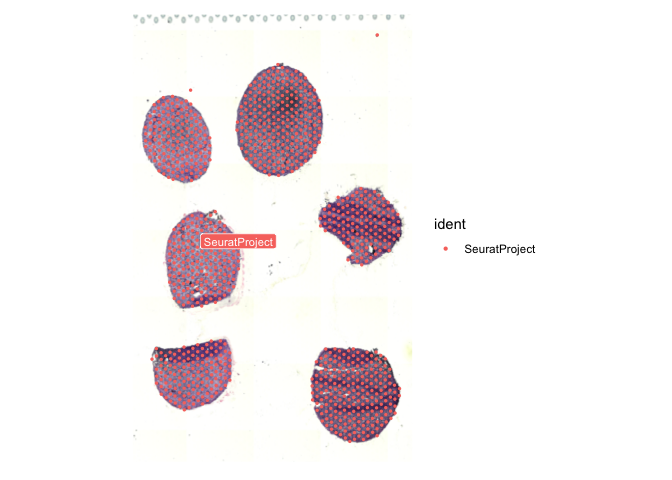<!-- -->

``` r
#SpatialDimPlot(GBO, crop = TRUE, label = TRUE, interactive = TRUE)
coords <- GetTissueCoordinates(GBO)
GBO@meta.data$x.coord <- coords[,1]
GBO@meta.data$y.coord  <- coords[,2]
GBO@meta.data$cells <- rownames(GBO@meta.data)

cells <- GBO@meta.data %>%
  dplyr::filter(x.coord < 1800, x.coord > 1000,
                y.coord > 1000, y.coord < 1800)
combined_11662_1 <- subset(GBO, cells = cells$cells)
SpatialDimPlot(combined_11662_1, label = TRUE, label.size = 3, pt.size.factor = 5, image.alpha = 1) + theme(aspect.ratio = 0.8)
```

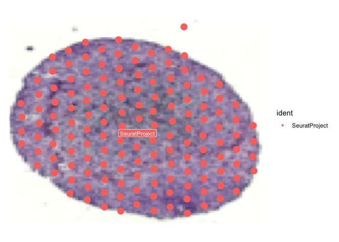<!-- -->

``` r
cells <- GBO@meta.data %>%
  dplyr::filter(x.coord < 2900, x.coord > 1900,
                y.coord > 1200, y.coord < 2100)
combined_11662_2 <- subset(GBO, cells = cells$cells)
SpatialDimPlot(combined_11662_2, label = TRUE, label.size = 3, pt.size.factor = 5, image.alpha = 1) + theme(aspect.ratio = 1.2)
```

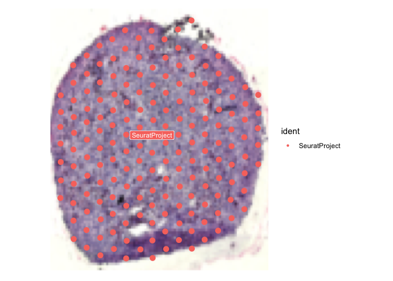<!-- -->

``` r
cells <- GBO@meta.data %>%
  dplyr::filter(x.coord < 3700, x.coord > 3100,
                y.coord > 1050, y.coord < 1950)
combined_11662_3 <- subset(GBO, cells = cells$cells)
SpatialDimPlot(combined_11662_3, label = TRUE, label.size = 3, pt.size.factor = 5, image.alpha = 1) + theme(aspect.ratio = 1.2)
```

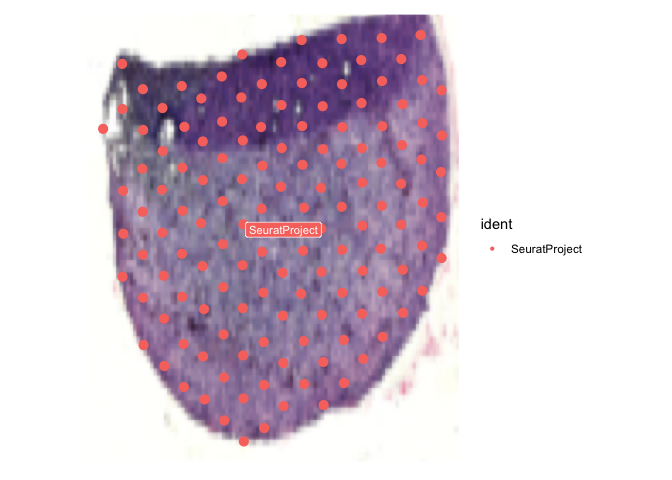<!-- -->

``` r
cells <- GBO@meta.data %>%
  dplyr::filter(x.coord < 1800, x.coord > 800,
                y.coord > 1950, y.coord < 3000)
combined_11556_1 <- subset(GBO, cells = cells$cells)
SpatialDimPlot(combined_11556_1, label = TRUE, label.size = 3, pt.size.factor = 5, image.alpha = 1) + theme(aspect.ratio = 0.8)
```

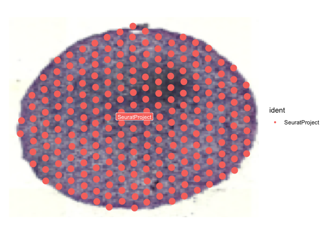<!-- -->

``` r
cells <- GBO@meta.data %>%
  dplyr::filter(x.coord < 2500, x.coord > 1800,
                y.coord > 2900, y.coord < 3800)
combined_11556_2 <- subset(GBO, cells = cells$cells)
SpatialDimPlot(combined_11556_2, label = TRUE, label.size = 3, pt.size.factor = 5, image.alpha = 1) + theme(aspect.ratio = 1.2)
```

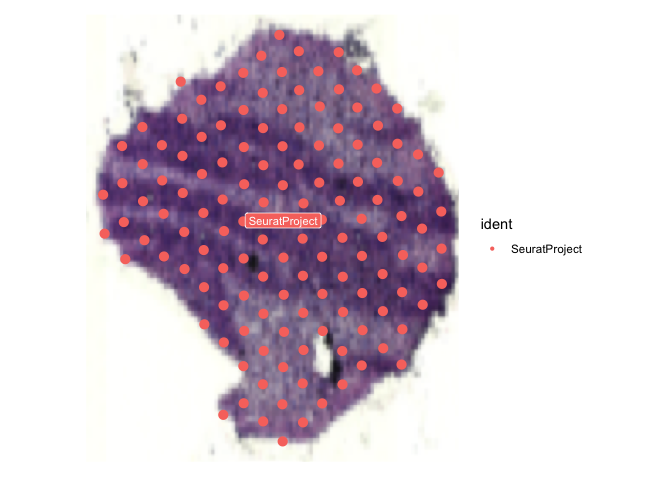<!-- -->

``` r
cells <- GBO@meta.data %>%
  dplyr::filter(x.coord < 4000, x.coord > 3100,
                y.coord > 2800, y.coord < 3800)
combined_11556_3 <- subset(GBO, cells = cells$cells)
SpatialDimPlot(combined_11556_3, label = TRUE, label.size = 3, pt.size.factor = 5, image.alpha = 1) + theme(aspect.ratio = 1.2)
```

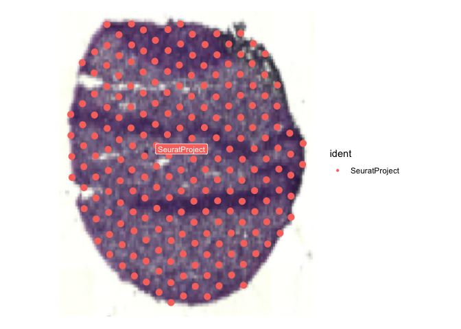<!-- -->

Next, we import FF (Batch 3) Visium section B, which is post-CAR-T
treatment.

``` r
GBO <- Load10X_Spatial('~/Library/CloudStorage/Box-Box/GBO_2/Hypoxia_Structure/GBM_Spatial/FF_Visium_12_2024/Visium_B/outs/',
                       filename = 'filtered_feature_bc_matrix.h5')
SpatialDimPlot(GBO, label = TRUE, label.size = 3, pt.size.factor = 2.25) + theme(aspect.ratio = 1.6)
```

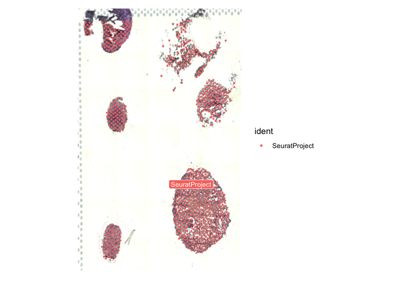<!-- -->

``` r
#SpatialDimPlot(GBO, crop = TRUE, label = TRUE, interactive = TRUE)
#GBO <- GBO %>% NormalizeData() %>% ScaleData()
#SpatialFeaturePlot(GBO, 'PTPRC')
coords <- GetTissueCoordinates(GBO)
GBO@meta.data$x.coord <- coords[,1]
GBO@meta.data$y.coord  <- coords[,2]
GBO@meta.data$cells <- rownames(GBO@meta.data)

cells <- GBO@meta.data %>%
  dplyr::filter(y.coord < 1800, y.coord > 650,
                x.coord > 600, x.coord < 1100)
combined_11662_CART_1 <- subset(GBO, cells = cells$cells)
SpatialDimPlot(combined_11662_CART_1, label = TRUE, label.size = 3,
               pt.size.factor = 5, image.alpha = 1) + theme(aspect.ratio = 0.8)
```

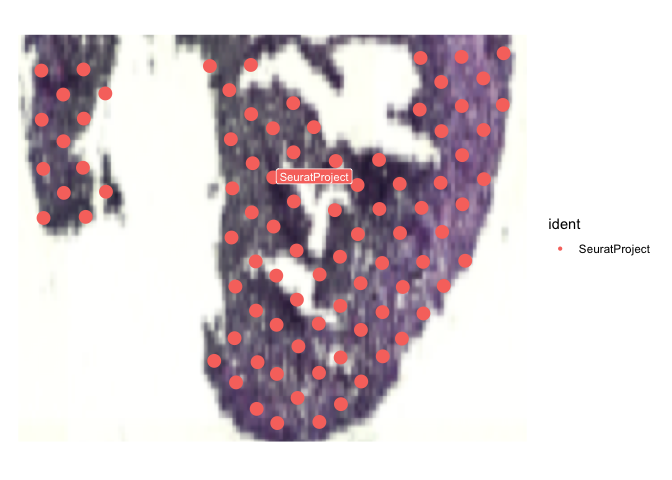<!-- -->

``` r
cells <- GBO@meta.data %>%
  dplyr::filter(y.coord < 1700, y.coord > 1000,
                x.coord > 1700, x.coord < 2300)
combined_11662_CART_2 <- subset(GBO, cells = cells$cells)
SpatialDimPlot(combined_11662_CART_2, label = TRUE, label.size = 3,
               pt.size.factor = 5, image.alpha = 1) + theme(aspect.ratio = 0.8)
```

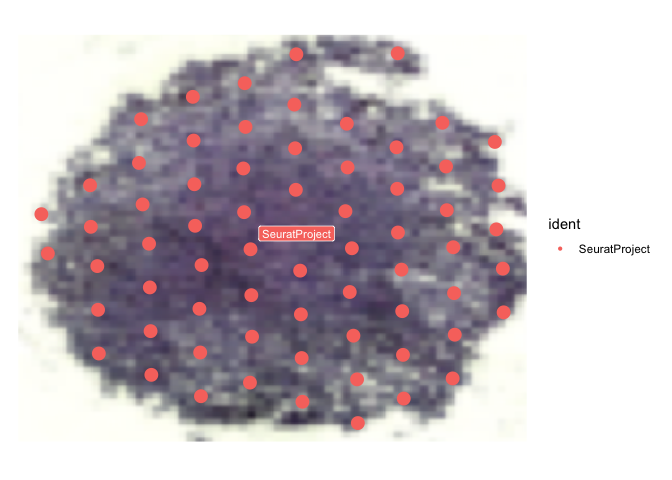<!-- -->

``` r
cells <- GBO@meta.data %>%
  dplyr::filter(y.coord < 1600, y.coord > 900,
                x.coord > 3600, x.coord < 4200)
combined_11662_CART_3 <- subset(GBO, cells = cells$cells)
SpatialDimPlot(combined_11662_CART_3, label = TRUE, label.size = 3,
               pt.size.factor = 5, image.alpha = 1) + theme(aspect.ratio = 0.8)
```

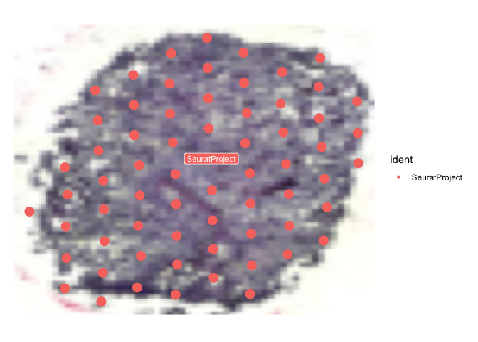<!-- -->

``` r
cells <- GBO@meta.data %>%
  dplyr::filter(y.coord < 3900, y.coord > 2500,
                x.coord > 600, x.coord < 1500)
combined_11556_CART_1 <- subset(GBO, cells = cells$cells)
SpatialDimPlot(combined_11556_CART_1, label = TRUE, label.size = 3,
               pt.size.factor = 5, image.alpha = 1) + theme(aspect.ratio = 0.8)
```

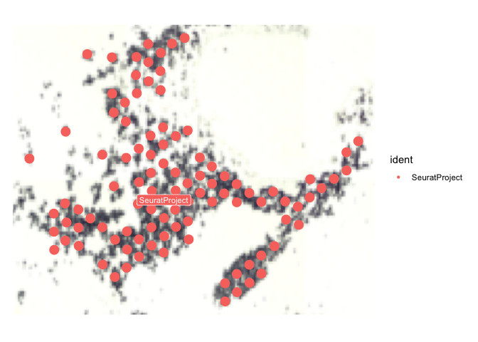<!-- -->

``` r
cells <- GBO@meta.data %>%
  dplyr::filter(y.coord < 4150, y.coord > 3300,
                x.coord > 1500, x.coord < 2200)
combined_11556_CART_2 <- subset(GBO, cells = cells$cells)
SpatialDimPlot(combined_11556_CART_2, label = TRUE, label.size = 3,
               pt.size.factor = 5, image.alpha = 1) + theme(aspect.ratio = 0.8)
```

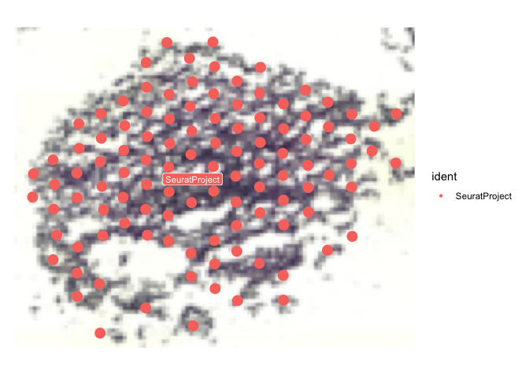<!-- -->

``` r
cells <- GBO@meta.data %>%
  dplyr::filter(y.coord < 4100, y.coord > 2700,
                x.coord > 2800, x.coord < 4100)
combined_11556_CART_3 <- subset(GBO, cells = cells$cells)
SpatialDimPlot(combined_11556_CART_3, label = TRUE, label.size = 3,
               pt.size.factor = 5, image.alpha = 1) + theme(aspect.ratio = 0.8)
```

<!-- -->

Finally we import FF (Batch 3) section C, which is after radiation/TMZ
treatment.

``` r
GBO <- Load10X_Spatial('~/Library/CloudStorage/Box-Box/GBO_2/Hypoxia_Structure/GBM_Spatial/FF_Visium_12_2024/Visium_C/outs/',
                       filename = 'filtered_feature_bc_matrix.h5')
SpatialDimPlot(GBO, label = TRUE, label.size = 3, pt.size.factor = 2.25) + theme(aspect.ratio = 1.6)
```

<!-- -->

``` r
#SpatialDimPlot(GBO, crop = TRUE, label = TRUE, interactive = TRUE)
#GBO <- GBO %>% NormalizeData() %>% ScaleData()
#SpatialFeaturePlot(GBO, 'PTPRC')
coords <- GetTissueCoordinates(GBO)
GBO@meta.data$x.coord <- coords[,1]
GBO@meta.data$y.coord  <- coords[,2]
GBO@meta.data$cells <- rownames(GBO@meta.data)

cells <- GBO@meta.data %>%
  dplyr::filter(y.coord < 3500, y.coord > 2200,
                x.coord > 1300, x.coord < 1900)
combined_11662_Rad_1 <- subset(GBO, cells = cells$cells)
SpatialDimPlot(combined_11662_Rad_1, label = TRUE, label.size = 3,
               pt.size.factor = 5, image.alpha = 1) + theme(aspect.ratio = 0.8)
```

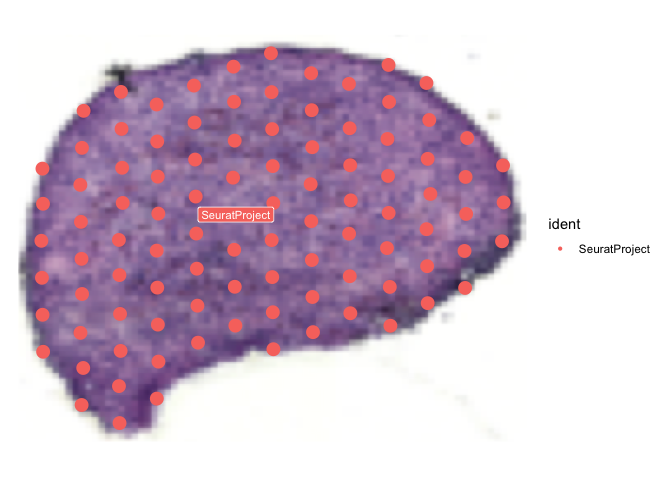<!-- -->

``` r
cells <- GBO@meta.data %>%
  dplyr::filter(y.coord < 3600, y.coord > 2800,
                x.coord > 2000, x.coord < 3000)
combined_11662_Rad_2 <- subset(GBO, cells = cells$cells)
SpatialDimPlot(combined_11662_Rad_2, label = TRUE, label.size = 3,
               pt.size.factor = 5, image.alpha = 1) + theme(aspect.ratio = 0.8)
```

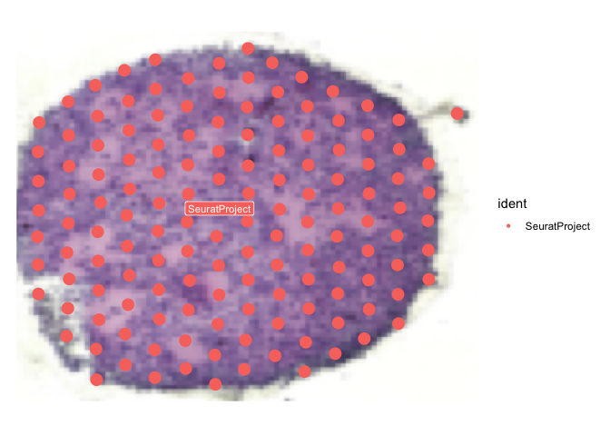<!-- -->

``` r
cells <- GBO@meta.data %>%
  dplyr::filter(y.coord < 2000, y.coord > 1100,
                x.coord > 1000, x.coord < 2100)
combined_11556_Rad_1 <- subset(GBO, cells = cells$cells)
SpatialDimPlot(combined_11556_Rad_1, label = TRUE, label.size = 3,
               pt.size.factor = 5, image.alpha = 1) + theme(aspect.ratio = 0.8)
```

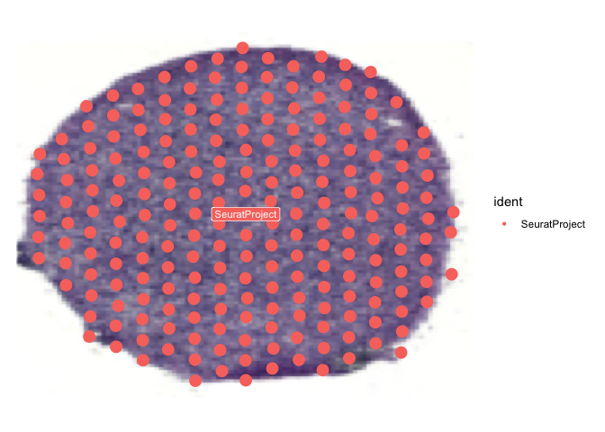<!-- -->

``` r
cells <- GBO@meta.data %>%
  dplyr::filter(y.coord < 2200, y.coord > 1200,
                x.coord > 2100, x.coord < 3000)
combined_11556_Rad_2 <- subset(GBO, cells = cells$cells)
SpatialDimPlot(combined_11556_Rad_2, label = TRUE, label.size = 3,
               pt.size.factor = 5, image.alpha = 1) + theme(aspect.ratio = 0.8)
```

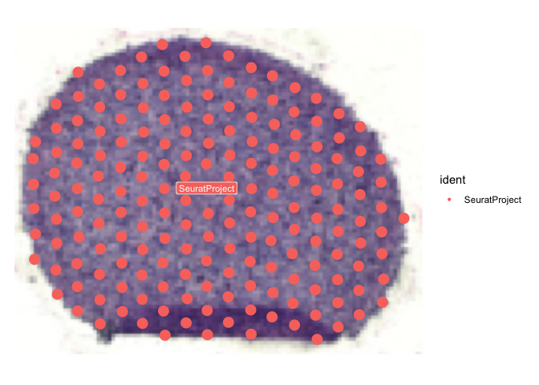<!-- -->

``` r
cells <- GBO@meta.data %>%
  dplyr::filter(y.coord < 1800, y.coord > 800,
                x.coord > 3200, x.coord < 4000)
combined_11556_Rad_3 <- subset(GBO, cells = cells$cells)
SpatialDimPlot(combined_11556_Rad_3, label = TRUE, label.size = 3,
               pt.size.factor = 5, image.alpha = 1) + theme(aspect.ratio = 0.8)
```

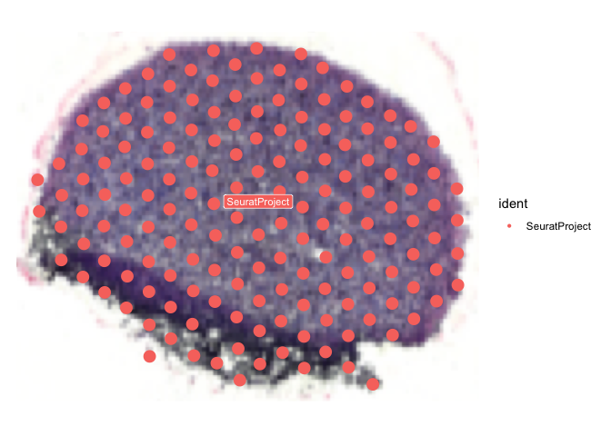<!-- -->

We combine all of these gGBO data and integrate them with Seurat v5 by
line (rather by organoid, which may remove effects of treatment).

``` r
name_list <- c(combined_11556_1, combined_11556_2, combined_11556_3, combined_11662_1, combined_11662_2, combined_11662_3, 
               combined_11556_CART_1, combined_11556_CART_2, combined_11556_CART_3, combined_11662_CART_1, combined_11662_CART_2, combined_11662_CART_3, 
               combined_11556_Rad_1, combined_11556_Rad_2, combined_11556_Rad_3, combined_11662_Rad_1, combined_11662_Rad_2)
sliceIDs <- c("slice1", "slice2", "slice3", "slice4", "slice5",
              "slice6", "slice7", "slice8", "slice9", "slice10", "slice11", "slice12",
              "slice13", "slice14", "slice15", "slice16", "slice17")
line_list <- c('11556', '11556', '11556', '11662', '11662', '11662',
               '11556', '11556', '11556', '11662', '11662', '11662',
               '11556', '11556', '11556', '11662', '11662')
condition <- c('GBO', 'GBO', 'GBO', 'GBO', 'GBO', 'GBO',
               'CART', 'CART', 'CART','CART','CART','CART',
               'Rad', 'Rad', 'Rad', 'Rad', 'Rad')
visium.list <- c()
for (i in 1:17){
  print(i)
  seurat <- name_list[[i]]
  seurat$slice <- i
  seurat$sliceid <- sliceIDs[i]
  seurat$line <- line_list[i]
  seurat$condition <- condition[i]
  names(seurat@images) <- sliceIDs[i]
  seurat@images[[sliceIDs[i]]]@key <- sliceIDs[i]
  visium.list[[i]] <- seurat
}
```

    ## [1] 1
    ## [1] 2
    ## [1] 3
    ## [1] 4
    ## [1] 5
    ## [1] 6
    ## [1] 7
    ## [1] 8
    ## [1] 9
    ## [1] 10
    ## [1] 11
    ## [1] 12
    ## [1] 13
    ## [1] 14
    ## [1] 15
    ## [1] 16
    ## [1] 17

``` r
visium.merge <- merge(visium.list[[1]], c(visium.list[[2]], visium.list[[3]], visium.list[[4]], visium.list[[5]], 
                                          visium.list[[6]], visium.list[[7]], visium.list[[8]], visium.list[[9]], 
                                          visium.list[[10]], visium.list[[11]], visium.list[[12]], visium.list[[13]], 
                                          visium.list[[14]], visium.list[[15]], visium.list[[16]], visium.list[[17]]))
```

``` r
visium.merge <- JoinLayers(visium.merge)
visium.merge[["Spatial"]] <- split(visium.merge[["Spatial"]], f = visium.merge$line)
visium.merge <- visium.merge %>% SCTransform(assay = "Spatial", vars.to.regress = c('nCount_Spatial')) %>% RunPCA(npcs = 30)
visium.merge <- IntegrateLayers(
  object = visium.merge, method = CCAIntegration, k.weight = 40, normalization.method = 'SCT',
  orig.reduction = "pca", new.reduction = "integrated.cca", verbose = FALSE)
visium.merge <- FindNeighbors(visium.merge, reduction = "integrated.cca", dims = 1:30)
visium.merge <- FindClusters(visium.merge, resolution = 0.5, cluster.name = "cca_clusters")
```

    ## Modularity Optimizer version 1.3.0 by Ludo Waltman and Nees Jan van Eck
    ## 
    ## Number of nodes: 2696
    ## Number of edges: 121243
    ## 
    ## Running Louvain algorithm...
    ## Maximum modularity in 10 random starts: 0.8080
    ## Number of communities: 8
    ## Elapsed time: 0 seconds

``` r
visium.merge <- RunUMAP(visium.merge, reduction = "integrated.cca", dims = 1:27, reduction.name = "umap.cca", min.dist = 0.1, n.neighbors = 30)
```

We then visualize the data. Note that with update to Seurat version the
UMAPs may appear slightly different from the main figures upon
re-running the code.

``` r
DimPlot(visium.merge, reduction = 'umap.cca', group.by = c('line'), pt.size = 0.4) & NoAxes() & 
  scale_color_manual(values = c("#375E97", "#e76f51")) 
```

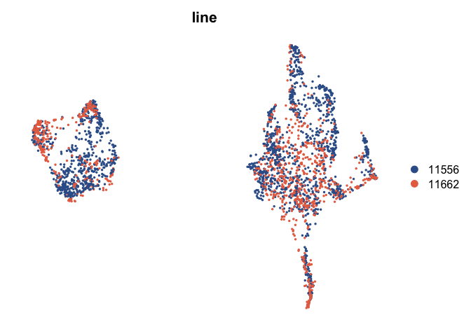<!-- -->

``` r
#ggsave('Figures/Visium_spots_UMAP_by_line.pdf', units = 'in', width = 4, height = 3)

DimPlot(visium.merge, reduction = 'umap.cca', group.by = c('condition'), pt.size = 0.4) & NoAxes() & 
  scale_color_manual(values = c("#375E97", "#962E2A", "#ffb703"))  
```

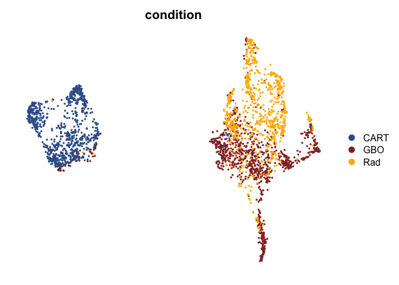<!-- -->

``` r
#ggsave('Figures/Visium_spots_UMAP_by_condition.pdf', units = 'in', width = 4, height = 3)

#saveRDS(visium.merge, 'GBO_Visium_RPCA_Integrated_Round_2_021525.RDS')
```

``` r
installed.packages()[names(sessionInfo()$otherPkgs), "Version"]
```

    ##       future      viridis  viridisLite      cowplot    patchwork    lubridate 
    ##     "1.40.0"      "0.6.5"      "0.4.2"      "1.1.3"      "1.3.0"      "1.9.4" 
    ##      forcats      stringr        dplyr        purrr        readr        tidyr 
    ##      "1.0.0"      "1.5.1"      "1.1.4"      "1.0.4"      "2.1.5"      "1.3.1" 
    ##       tibble      ggplot2    tidyverse       Seurat SeuratObject           sp 
    ##      "3.2.1"      "3.5.2"      "2.0.0"      "5.3.0"      "5.1.0"      "2.2-0"
